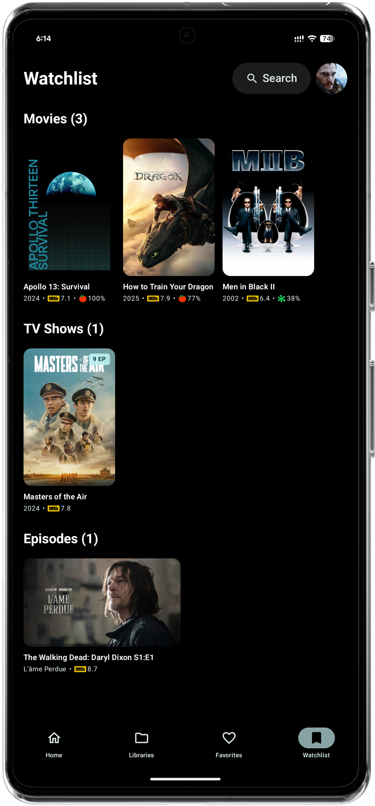

# Afinity - Yet Another Jellyfin Client

<p align="center">
  
</p>
  
[](https://github.com/MakD/AFinity/releases)


[](https://github.com/MakD/AFinity/stargazers)
[](https://github.com/MakD/AFinity/issues)
[](https://github.com/MakD/AFinity/pulls)
[](https://github.com/MakD/AFinity/releases)
[](https://github.com/MakD/AFinity/blob/master/LICENSE.md)

A native Android client for Jellyfin servers built with Jetpack Compose and Material 3.

## Overview

<p>
 &nbsp;
 &nbsp;
 &nbsp;
 &nbsp;
</p>

Afinity provides a clean, responsive interface for accessing your Jellyfin media library on Android devices. The app focuses on delivering smooth playback performance and an intuitive browsing experience.

## Reach out

<a href="https://discord.com/channels/1381737066366242896/1422939582533730325"></a>

Connect with us on [Discord](https://discord.gg/uZTjF8c2Vm) and be part of the discussion

## Features

**Media Playback**

- Hardware-accelerated video playback with LibMPV
- Multiple audio and subtitle track support
- Resume functionality across sessions
- Trickplay navigation with thumbnail previews
- Media Segments Support (Intro/Outro Skipper)

**Content Discovery**

- Library browsing by content type
- Search and filtering capabilities
- Favorites management
- Cast and crew information

**Interface**

- Material 3 design with system theming
- Responsive layouts for different screen sizes
- Gesture-based player controls
- Dark and light theme support

**Server Integration**

- Secure authentication
- Playback progress synchronization
- Multiple quality options
- Background library updates

## Screenshots

<p align="center">
  
  &nbsp;
  
  &nbsp;
  
  &nbsp;
  
  &nbsp;
  
  &nbsp;
  
  &nbsp;
  
</p>

## Installation

**Requirements**

- Android 14+ (API level 35)
- Jellyfin server 10.8+

**Download Options**

#### GitHub Releases

Download the latest APK from our [Releases page](https://github.com/MakD/AFinity/releases)

#### From Source

```bash
git clone https://github.com/MakD/AFinity.git
cd AFinity
./gradlew assembleRelease
```

## Setup

1. Install and launch Afinity
2. Enter your Jellyfin server address (e.g., `http://192.168.1.100:8096`)
3. Sign in with your credentials
4. Access your media library

For remote access, ensure your Jellyfin server is configured for external connections.

## Technical Details

- **Language**: Kotlin
- **UI**: Jetpack Compose + Material 3
- **Architecture**: MVVM with Repository pattern
- **DI**: Hilt
- **Navigation**: Navigation Compose
- **Player**: LibMPV
- **Networking**: Retrofit + Jellyfin SDK
- **Images**: Coil with BlurHash
- **Storage**: Room

## Development

**Building**

```bash
./gradlew build
./gradlew test
./gradlew installDebug
```

**Contributing**

1. Fork the repository
2. Create a feature branch
3. Make your changes
4. Submit a pull request

## Roadmap

### Core Features

- [X] Download management for offline viewing
- [ ] Adaptive streaming with quality selection (transcoding support)
- [ ] Chromecast support
- [ ] Enhanced accessibility features
- [ ] Multi-user profile switching
- [ ] Multi-server support

### Player Enhancements

- [X] Picture-in-picture mode
- [X] Advanced subtitle styling options
- [ ] Audio delay adjustment
- [X] Playback speed controls

### UI/UX Improvements

- [X] Tablet-optimized layouts
- [X] Advanced search filters
- [X] Custom library views
- [X] Gesture customization

### Technical

- [ ] Background sync optimization
- [ ] Cache management
- [ ] Network quality detection
- [ ] Performance monitoring

## Acknowledgments

- [Jellyfin](https://jellyfin.org/) - Open source media server
- [MPV](https://mpv.io/) - Media player engine
- [libmpv-android](https://github.com/jarnedemeulemeester/libmpv-android) by Jarne Demeulemeester - Android MPV integration

## Privacy

Afinity respects your privacy:

- **No tracking or analytics** are collected
- **All data stays local** or with your own Jellyfin server
- **No third-party services** are used without your explicit consent
- **Source code is open** for full transparency

## Disclaimer
AFinity does not support or condone piracy. The app is only for streaming media you personally own. It includes no media content, and any references or support requests related to piracy or related tools are strictly prohibited.

## License

LGPL-3.0 License - see [LICENSE](LICENSE.md) for details.

---

**Made with ❤️ for the Jellyfin community**

_Afinity is not affiliated with Jellyfin. Jellyfin is a trademark of the Jellyfin project._
