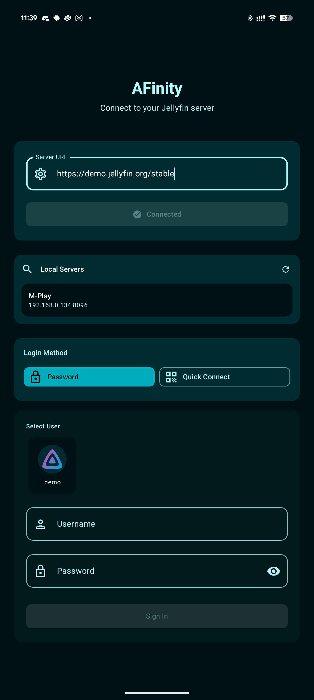
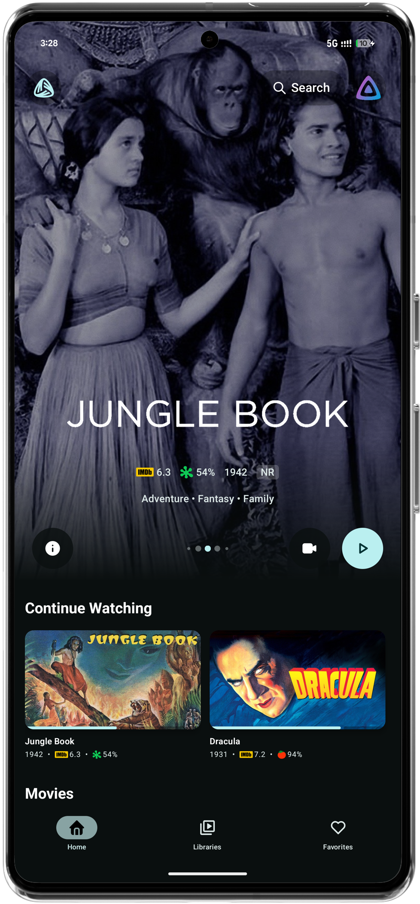
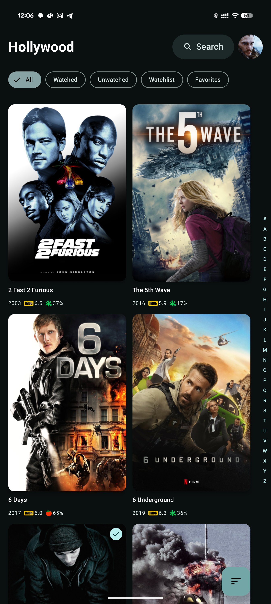
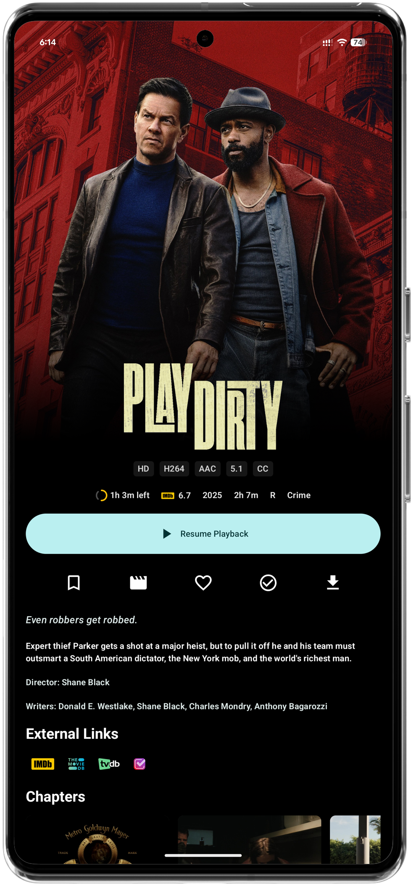
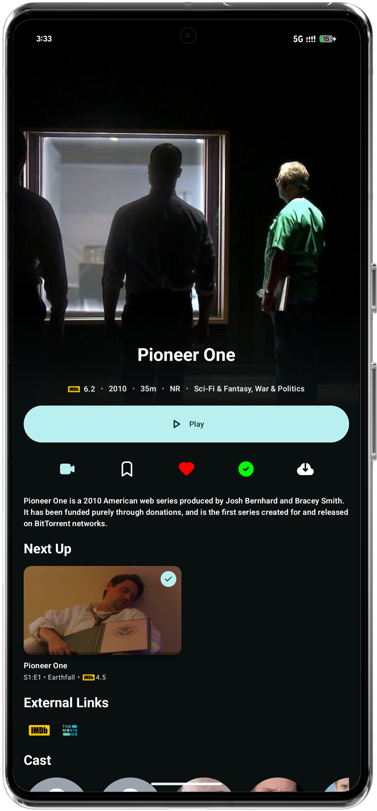
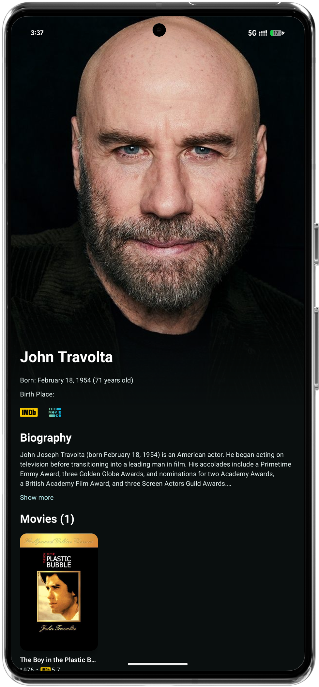

# Afinity - Yet Another Jellyfin Client

[](https://github.com/MakD/AFinity/releases)
[](https://github.com/MakD/AFinity/stargazers)
[](https://github.com/MakD/AFinity/issues)
[](https://github.com/MakD/AFinity/pulls)
[](https://github.com/MakD/AFinity/releases)
[](https://github.com/MakD/AFinity/blob/master/LICENSE.md)

A native Android client for Jellyfin servers built with Jetpack Compose and Material 3.

## Overview

Afinity provides a clean, responsive interface for accessing your Jellyfin media library on Android devices. The app focuses on delivering smooth playback performance and an intuitive browsing experience.

## Features

**Media Playback**

- Hardware-accelerated video playback with LibMPV
- Multiple audio and subtitle track support
- Resume functionality across sessions
- Trickplay navigation with thumbnail previews
- Media Segments Support (Intro/Outro Skipper)

**Content Discovery**

- Library browsing by content type
- Search and filtering capabilities
- Favorites management
- Cast and crew information

**Interface**

- Material 3 design with system theming
- Responsive layouts for different screen sizes
- Gesture-based player controls
- Dark and light theme support

**Server Integration**

- Secure authentication
- Playback progress synchronization
- Multiple quality options
- Background library updates

## Screenshots

| Feature           | Preview                                          |
| ----------------- | ------------------------------------------------ |
| Login             |                   |
| Home Screen       |              |
| Library Browser   |               |
| Movie Details     |   |
| TV Show Details   |  |
| Episode Selection |             |
| Person Details    |                 |

## Installation

**Requirements**

- Android 14+ (API level 35)
- Jellyfin server 10.8+

**Download Options**

#### GitHub Releases

Download the latest APK from our [Releases page](https://github.com/MakD/AFinity/releases)

#### From Source

```bash
git clone https://github.com/MakD/AFinity.git
cd AFinity
./gradlew assembleRelease
```

## Setup

1. Install and launch Afinity
2. Enter your Jellyfin server address (e.g., `http://192.168.1.100:8096`)
3. Sign in with your credentials
4. Access your media library

For remote access, ensure your Jellyfin server is configured for external connections.

## Technical Details

- **Language**: Kotlin
- **UI**: Jetpack Compose + Material 3
- **Architecture**: MVVM with Repository pattern
- **DI**: Hilt
- **Navigation**: Navigation Compose
- **Player**: LibMPV
- **Networking**: Retrofit + Jellyfin SDK
- **Images**: Coil with BlurHash
- **Storage**: Room

## Development

**Building**

```bash
./gradlew build
./gradlew test
./gradlew installDebug
```

**Contributing**

1. Fork the repository
2. Create a feature branch
3. Make your changes
4. Submit a pull request

## Roadmap

### Core Features

- [ ] Download management for offline viewing
- [ ] Adaptive streaming with quality selection (transcoding support)
- [ ] Chromecast support
- [ ] Enhanced accessibility features
- [ ] Multi-user profile switching
- [ ] Multi-server support

### Player Enhancements

- [ ] Picture-in-picture mode
- [ ] Advanced subtitle styling options
- [ ] Audio delay adjustment
- [ ] Playback speed controls

### UI/UX Improvements

- [ ] Tablet-optimized layouts
- [ ] Advanced search filters
- [ ] Custom library views
- [ ] Gesture customization

### Technical

- [ ] Background sync optimization
- [ ] Cache management
- [ ] Network quality detection
- [ ] Performance monitoring

## Acknowledgments

- [Jellyfin](https://jellyfin.org/) - Open source media server
- [MPV](https://mpv.io/) - Media player engine
- [libmpv-android](https://github.com/jarnedemeulemeester/libmpv-android) by Jarne Demeulemeester - Android MPV integration

## Privacy

Afinity respects your privacy:

- **No tracking or analytics** are collected
- **All data stays local** or with your own Jellyfin server
- **No third-party services** are used without your explicit consent
- **Source code is open** for full transparency

## License

LGPL-3.0 License - see [LICENSE](LICENSE.md) for details.

---

**Made with ❤️ for the Jellyfin community**

_Afinity is not affiliated with Jellyfin. Jellyfin is a trademark of the Jellyfin project._
