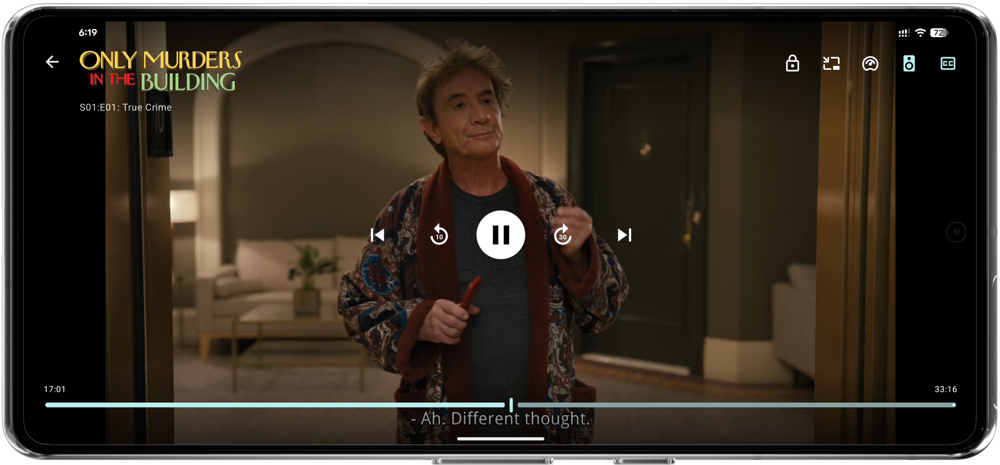

# Afinity - Yet Another Jellyfin Client

<div align="center">
  
  
[![Release](https://img.shields.io/github/v/release/MakD/AFinity?style=for-the-badge&logo=data:image/svg+xml;base64,PHN2ZyB4bWxucz0iaHR0cDovL3d3dy53My5vcmcvMjAwMC9zdmciIHZpZXdCb3g9IjIyIDIwIDY0IDY0Ij48cGF0aCBmaWxsPSIjZmZmZmZmIiBmaWxsLXJ1bGU9ImV2ZW5vZGQiIGQ9Ik0yMy4xNiw2OS45NmMwLjA0LC0zLjM3IDAuNjMsLTYuMTEgMS40NywtOC44YzEuNjIsLTUuMiAzLjk4LC0xMC4wNiA2LjY0LC0xNC43OWMyLjQzLC00LjM0IDUuMDksLTguNTIgOC4yMywtMTIuMzljMi4zLC0yLjgzIDQuODEsLTUuNDYgNy44NiwtNy41MWMxLjUzLC0xLjAzIDMuMTYsLTEuODIgNC45OSwtMi4xOGMyLjQ0LC0wLjQ4IDQuNjgsMC4xNSA2LjgxLDEuMjljMi43NywxLjQ5IDUuMDMsMy42MSA3LjE1LDUuOWM0LjEyLDQuNDcgNy4zOSw5LjU1IDEwLjQxLDE0LjhjMi40MSw0LjE4IDQuNTIsOC41IDYuMTMsMTMuMDZjMS4wOCwzLjA4IDEuODksNi4yMyAyLDkuNTFjMC4wOSwyLjUgLTAuMjUsNC45MSAtMS43NCw3LjAyYy0xLjMxLDEuODcgLTMuMTQsMy4wOCAtNS4xNSw0LjA1Yy0zLjMsMS41OCAtNi44MiwyLjQzIC0xMC40MSwyLjk0Yy05LjA4LDEuMjkgLTE4LjE3LDEuMzQgLTI3LjI1LDAuMDFjLTMuOTEsLTAuNTcgLTcuNzIsLTEuNTcgLTExLjIyLC0zLjQ3Yy0yLjAyLC0xLjA5IC0zLjc2LC0yLjUyIC00LjgxLC00LjYyQzIzLjQsNzMuMTEgMjMuMTcsNzEuMjkgMjMuMTYsNjkuOTZ6TTU0LjM1LDM1LjE3YzcuMTIsNC4yNiAxMi45OSw5Ljc3IDE4LjUyLDE1LjY5Yy0wLjA1LC0wLjE5IC0wLjEyLC0wLjM2IC0wLjIxLC0wLjUxYy0xLjQ1LC0yLjQgLTIuODQsLTQuODQgLTQuMzUsLTcuMmMtMi40MiwtMy43NyAtNS4xOSwtNy4yNyAtOC40NiwtMTAuMzVjLTEuMDQsLTAuOTggLTIuMTQsLTEuOSAtMy40NiwtMi40OWMtMS43MywtMC43OCAtMy4xOCwtMC40IC00LjE4LDEuMjFjLTAuNTYsMC45IC0xLjA0LDEuODcgLTEuMzcsMi44NmMtMS42NCw0LjkyIC0yLjI4LDEwLjAyIC0yLjUsMTUuMThjLTAuMTcsMy45NSAtMC4wNSw3LjkgMC4zNCwxMS44NGMwLjAzLDAuMyAtMC4wMiwwLjQ4IC0wLjMxLDAuNjRjLTEuNDgsMC44MyAtMi45NCwxLjY5IC00LjQxLDIuNTNjLTAuMTMsMC4wNyAtMC4yNiwwLjEyIC0wLjQ4LDAuMjJjLTAuNjksLTUuMjMgLTAuNzMsLTEwLjQyIC0wLjQ3LC0xNS42OGMtMC4xMSwwLjA4IC0wLjE0LDAuMSAtMC4xNiwwLjEyYy0wLjA1LDAuMTMgLTAuMDksMC4yNSAtMC4xMywwLjM4Yy0xLjcyLDUuNjMgLTIuOTQsMTEuMzQgLTMuMjYsMTcuMjNjLTAuMDEsMC4yNiAtMC4wOCwwLjQyIC0wLjM1LDAuNTJjLTEuNTUsMC41OSAtMy4xLDEuMiAtNC42NCwxLjhjLTAuMTcsMC4wNiAtMC4zNCwwLjEgLTAuNTksMC4xOGMwLjAyLC00LjExIDAuNTQsLTguMDggMS4zLC0xMi4wM2MwLjc2LC0zLjk0IDEuODEsLTcuODEgMi45NiwtMTEuNjdjLTAuMTUsMC4xMiAtMC4yNiwwLjI1IC0wLjM0LDAuNGMtMC43OCwxLjM1IC0xLjU4LDIuNjkgLTIuMzQsNC4wNmMtMi42NSw0LjgxIC00Ljk0LDkuNzkgLTYuMjYsMTUuMTVjLTAuMzQsMS4zNiAtMC40OCwyLjc4IC0wLjYxLDQuMTdjLTAuMDgsMC44OCAwLjEyLDEuNzYgMC42NywyLjVjMC42NywwLjkgMS42NywxLjI0IDIuNzIsMS4yYzEuMzIsLTAuMDYgMi42NSwtMC4xOCAzLjk0LC0wLjQ3YzMuNzQsLTAuODUgNy4yOSwtMi4yNSAxMC43NSwtMy44OGM0LjQzLC0yLjA5IDguNTksLTQuNjMgMTIuNTgsLTcuNDZjMC4zOCwtMC4yNyAwLjY1LC0wLjI4IDEuMDUsLTAuMDRjMS4zNiwwLjgzIDIuNzUsMS42MSA0LjEzLDIuNDFjMC4xNSwwLjA5IDAuMywwLjE5IDAuNTIsMC4zMmMtNC4yMSwzLjIzIC04LjcxLDUuODYgLTEzLjMzLDguMzFjMC4yMSwwLjAyIDAuMzgsLTAuMDEgMC41NiwwLjA5YzUuNywtMS4zNCAxMS4yNiwtMy4xMiAxNi41MSwtNS43OGMwLjI4LC0wLjE0IDAuNDcsLTAuMTIgMC43MSwwLjA3YzAuOTYsMC43OSAxLjk1LDEuNTUgMi45MiwyLjMzYzAuNDUsMC4zNiAwLjg4LDAuNzQgMS40LDEuMTdjLTcuMTYsNC4wMSAtMTQuODMsNi4zMSAtMjIuNjYsOC4xN2MwLjIsMC4wOCAwLjM4LDAuMSAwLjU2LDAuMDljMy40NSwtMC4xIDYuOTEsLTAuMSAxMC4zNSwtMC4zMmMzLjkyLC0wLjI1IDcuNzgsLTAuOTQgMTEuNTMsLTIuMTJjMS4yOSwtMC40MSAyLjU0LC0wLjg5IDMuNjIsLTEuNzRjMS4yNywtMC45OSAxLjYsLTIuMTkgMS4wNSwtMy43MWMtMC40NSwtMS4yMyAtMS4yNSwtMi4yMyAtMi4xLC0zLjE4Yy0zLjAxLC0zLjM0IC02LjUyLC02LjEgLTEwLjIzLC04LjU5Yy0zLjc3LC0yLjUzIC03Ljc0LC00LjcyIC0xMS44NywtNi41OWMtMC4zMiwtMC4xNSAtMC41LC0wLjMxIC0wLjUsLTAuNjljMC4wMiwtMS42MyAwLjAxLC0zLjI2IDAuMDEsLTAuODhjMCwtMC4xOSAwLjAyLC0wLjM5IDAuMDMsLTAuNjdjNC45MSwyLjA0IDkuNDQsNC42MiAxMy44Nyw3LjRjLTAuMDQsLTAuMTQgLTAuMTEsLTAuMjMgLTAuMTksLTAuMzFjLTQuMDYsLTQuMzUgLTguNDMsLTguMzMgLTEzLjQzLC0xMS41OWMtMC4yNiwtMC4xNyAtMC4zNCwtMC4zNCAtMC4yOCwtMC42NmMwLjE1LC0wLjc4IDAuMjQsLTEuNTcgMC4zNywtMi4zNkM1NC4wMSwzNy4zIDU0LjE3LDM2LjMgNTQuMzUsMzUuMTd6Ii8+PC9zdmc+&labelColor=000000&color=41A67E)](https://github.com/MakD/AFinity/releases)
[](https://github.com/MakD/AFinity/stargazers)
[](https://github.com/MakD/AFinity/releases)
[](https://github.com/MakD/AFinity/blob/master/LICENSE.md)
<a href="https://discord.com/channels/1381737066366242896/1422939582533730325"></a>

[Download](#installation) • [View Screenshots](#screenshots) • [Report Bug](https://github.com/MakD/AFinity/issues) • [Request Feature](https://github.com/MakD/AFinity/issues)

</div>

## Overview

​AFinity is a native Android application that brings your Jellyfin media library to life with a clean, responsive interface. Stream your movies, TV shows, and live TV with hardware-accelerated playback, and discover new content through personalised recommendations. Beyond video, AFinity extends your experience with optional Audiobookshelf integration for audiobooks and podcasts, and direct media requests via Jellyseerr.

## Installation

<p align="center">
  <a href="https://github.com/MakD/AFinity/releases/latest"></a>&nbsp;<a href="https://apps.obtainium.imranr.dev/redirect?r=obtainium://app/%7B%22id%22%3A%22com.makd.afinity%22%2C%22url%22%3A%22https%3A%2F%2Fgithub.com%2FMakD%2FAFinity%22%2C%22author%22%3A%22MakD%22%2C%22name%22%3A%22AFinity%22%2C%22supportFixedAPKURL%22%3Afalse%7D"></a>
</p>

#### Build From Source

```bash
git clone https://github.com/MakD/AFinity.git
cd AFinity
./gradlew assembleRelease
```

## Initial Setup

1. **Launch AFinity** on your Android device
2. **Enter Server Address** - Your Jellyfin server URL (e.g., `http://192.168.1.100:8096`)
3. **Sign In** - Use your Jellyfin credentials
4. **Start Streaming** - Access your entire media library

> **Tip:** For remote access, ensure your Jellyfin server is configured for external connections

### Optional: Seerr Integration

Enable media requests by connecting to your Jellyseerr server:

1. Navigate to **Settings → General**
2. Toggle **Jellyseerr** on
3. Enter your Jellyseerr server URL
4. Choose authentication:
   - **Jellyfin** - Use your Jellyfin credentials
   - **Local** - Use Jellyseerr email/password
5. Tap **Connect**

The Requests tab will appear in your bottom navigation once connected.

## Screenshots

<p align="center">
  
  &nbsp;
  
  &nbsp;
  
  
  &nbsp;
  
  &nbsp;
  
  
  &nbsp;
  
  &nbsp;
  
  
  &nbsp;
  
  &nbsp;
  
  
</p>

## Features  
  
| **Category** | **Details** |  
|------------|------------|  
| **Media Playback** | - Hardware-accelerated video playback with LibMPV<br>- Multiple audio and subtitle track support<br>- Customizable subtitle appearance (color, size, position, style)<br>- Resume functionality across sessions<br>- Trickplay navigation with thumbnail previews<br>- Chapter markers and navigation<br>- Media Segments Support (Intro/Outro Skipper)<br>- Multiple video zoom modes (Fit, Zoom, Stretch)<br>- Picture-in-Picture mode with background audio control |  
| **Live TV** | - Watch live television channels<br>- Electronic Program Guide (EPG) with timeline navigation<br>- Browse programs by category (Movies, Sports, News, etc.)<br>- Mark channels as favourites<br>- Real-time program progress updates<br>- Direct stream support for IPTV sources |  
| **Content Discovery** | - Library browsing by content type<br>- Personalized home screen with dynamic recommendations<br>- Genre, studio, and network browsing<br>- Search and filtering capabilities with alphabet scroller<br>- Favorites and watchlist management<br>- Cast and crew information with full filmography<br>- Episode switcher in player for quick navigation |  
| **Seerr Integration** *(Optional)* | - Request movies and TV shows with season selection<br>- Browse trending, popular, and upcoming content<br>- Search integration with request filter<br>- Track request status (Pending, Approved, Available)<br>- Real-time request status updates across app<br>- Approve / Reject incoming requests (admin only)<br>- Detailed media information in request dialog (ratings, runtime, cast) |  
| **Audiobookshelf Integration** *(Optional)* | - Connect to Audiobookshelf servers for audiobook and podcast playback<br>- Browse libraries with tabbed navigation (Home, Series, Libraries)<br>- Genre-based discovery and series collections<br>- Background audio playback with media notifications and lock screen controls<br>- Sleep timer and adjustable playback speed<br>- Chapter navigation with progress syncing<br>- Persistent mini-player for navigation during playback<br>- Integration with main search |
| **Interface** | - Material 3 design with system theming<br>- Responsive adaptive layouts for phones, tablets, and foldables<br>- Gesture-based player controls (brightness, volume, seeking)<br>- Dark and light theme support with dynamic colors<br>- Customizable episode layout (horizontal/vertical)<br>- Edge-to-edge display support |  
| **Server Integration** | - Secure authentication with encrypted credential storage<br>- Multi-server & multi-user support with quick session switching<br>- Playback progress synchronization<br>- Multiple quality options<br>- Background library updates and downloads<br>- One-tap login for saved accounts |

## Technical Stack

<div align="center">


</div>

- **Language**: Kotlin
- **UI Framework**: Jetpack Compose + Material 3
- **Architecture**: MVVM with Repository pattern
- **Dependency Injection**: Hilt
- **Navigation**: Navigation Compose
- **Media Player**: LibMPV + ExoPlayer
- **Networking**: Retrofit + Jellyfin SDK
- **Image Loading**: Coil with BlurHash
- **Local Storage**: Room
- **Security** - Tink (Encrypted Credentials)
- **Preferences** - Jetpack DataStore

## Roadmap

### Core Features

- [X] Download management for offline viewing
- [ ] Adaptive streaming with quality selection (transcoding support)
- [ ] Chromecast support
- [X] Enhanced accessibility features
- [X] Multi-user profile switching
- [X] Multi-server support

### Player Enhancements

- [X] Picture-in-picture mode
- [X] Advanced subtitle styling options
- [ ] Audio delay adjustment
- [X] Playback speed controls

### UI/UX Improvements

- [X] Tablet-optimized layouts
- [X] Advanced search filters
- [X] Custom library views
- [X] Gesture customisation

### Technical

- [X] Background sync optimisation
- [ ] Cache management
- [X] Network quality detection
- [ ] Performance monitoring

## Contributing

We welcome contributions from the community! Whether you're a developer, designer, or translator, here is how you can help:

### Help Translate
We use **Weblate** to manage translations. You can help translate AFinity into your language directly in your browser without needing any technical knowledge.

1. Visit our [Weblate Project](https://hosted.weblate.org/projects/afinity-yet-another-jellyfin-client/).
2. Select your language (or start a new one).
3. Start translating! Changes are automatically synced back to this repository.

### Code Contributions

1. **Fork** the repository
2. **Create** a feature branch (`git checkout -b feature/AmazingFeature`)
3. **Commit** your changes (`git commit -m 'Add some AmazingFeature'`)
4. **Push** to the branch (`git push origin feature/AmazingFeature`)
5. **Open** a Pull Request

### Development Commands

```bash
# Build the project
./gradlew build

# Run tests
./gradlew test

# Install debug build
./gradlew installDebug
```

## Project Stats

<div align="center">

<a href="https://star-history.com/#MakD/AFinity&Date">
  <picture>
    <source media="(prefers-color-scheme: dark)" srcset="https://api.star-history.com/svg?repos=MakD/AFinity&type=Datee&legend=bottom-right&theme=dark" />
    <source media="(prefers-color-scheme: light)" srcset="https://api.star-history.com/svg?repos=MakD/AFinity&type=Datee&legend=bottom-right" />
    
  </picture>
</a>

&nbsp;


[](https://github.com/MakD/AFinity/issues)
[](https://github.com/MakD/AFinity/pulls)

</div>

[](https://hosted.weblate.org/engage/afinity-yet-another-jellyfin-client/)

## Acknowledgments

AFinity stands on the shoulders of giants. Special thanks to:

- [Jellyfin](https://jellyfin.org/) - The open source media server that makes it all possible
- [MPV](https://mpv.io/) - Media player engine
- [libmpv-android](https://github.com/jarnedemeulemeester/libmpv-android) by Jarne Demeulemeester - Android MPV integration
- [Seerr](https://github.com/seerr-team/seerr) - Open-source media discovery and request manager for Jellyfin, Plex, and Emby.
- [Audiobookshelf](https://github.com/advplyr/audiobookshelf) - Open-source self-hosted audiobook and podcast server.

## Privacy

Afinity respects your privacy:

- **No tracking or analytics** are collected
- **All data stays local** or with your own Jellyfin server
- **No third-party services** are used without your explicit consent
- **Source code is open** for full transparency

## Disclaimer
**AFinity does not support or condone piracy.** This application is designed solely for streaming media content that you personally own or have legal rights to access. AFinity includes no media content whatsoever. Any references, discussions, or support requests related to piracy or related tools are strictly prohibited and will be removed.

## License

This project is licensed under the **LGPL-3.0 License** - see the [LICENSE](LICENSE.md) file for details.

## Support the Project

AFinity is a personal project developed and maintained in my free time. If the app has improved your media experience, there are a few ways you can help support its growth:

### Community Support
* **Star the Project:** Give us a ⭐ on GitHub—it helps others find the app!
* **Contribute:** AFinity is open-source. Bug reports and Pull Requests are always welcome.
* **Join the Discussion:** Share your feedback or get help on our [Discord](https://discord.com/channels/1381737066366242896/1422939582533730325).

### Buy the Developer a Coffee
If you've spent hours enjoying your library through AFinity and want to show some appreciation, you can support my work here. It helps keep me fueled for those late-night coding sessions!

[](https://ko-fi.com/m0rph3us)
[](https://buymeacoffee.com/m0rphi)

*Every contribution, whether it's code, a bug report, or a coffee, helps make AFinity better.*

---

**Made with ❤️ for the Jellyfin community**

*AFinity is an independent project and is not affiliated with Jellyfin, Audiobookshelf or Seerr.*  
*Jellyfin is a trademark of the Jellyfin project.*

---

**[Back to Top](#afinity---yet-another-jellyfin-client)**
